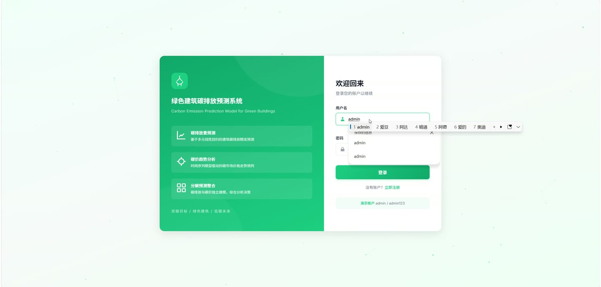
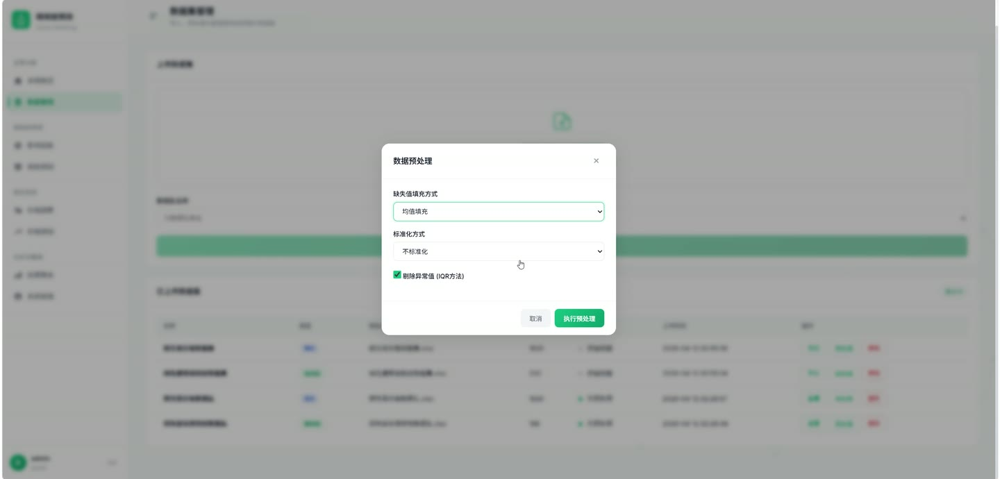
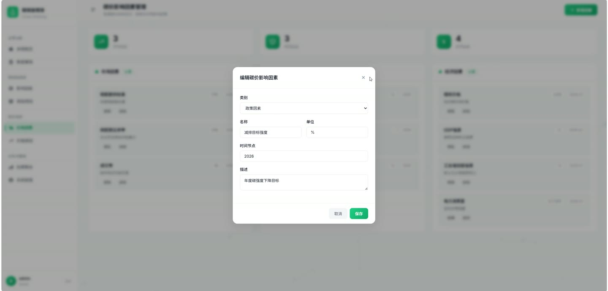
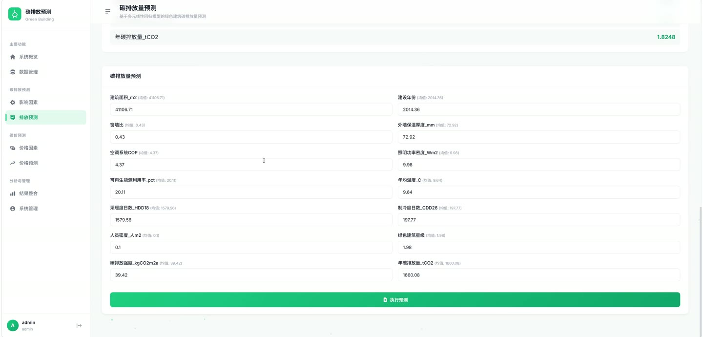
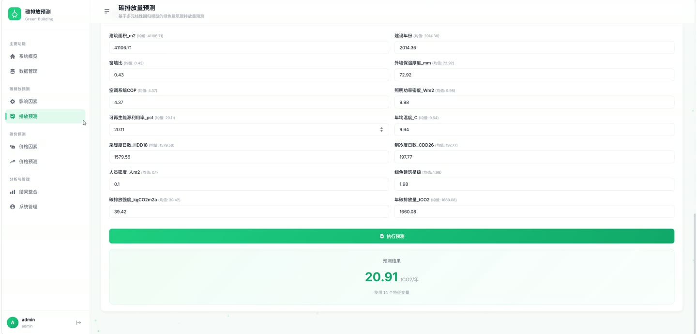

# (附文档)Python+机器学习 双碳目标绿色建筑碳排放预测模型

**技术栈**：Python、Flask、机器学习

### 系统简介

本系统是基于 Python 与 Flask 构建的双碳目标下绿色建筑碳排放预测平台，采用 Flask 模板渲染架构，通过机器学习模型对建筑碳排放数据进行建模与预测。系统包含普通用户与管理员两类角色，覆盖数据导入、模型训练、碳排放预测、碳价分析与结果可视化等完整业务流程。
 
### 核心功能
 
### 普通用户端

 
- 账号注册与登录：填写用户名、密码完成注册，登录后进入系统主界面。 
- 个人中心：查看当前登录账号信息，修改个人密码。 
- 数据看板：查看碳排放总量、建筑数量、预测任务数等关键指标概览。 
- 数据上传：支持上传 xlsx、xls、csv 格式的建筑能耗与碳排放数据文件，单文件最大 50MB。 
- 数据列表查询：分页查看已上传的数据记录，支持按名称、时间等条件筛选。 
- 数据编辑与删除：对已导入的数据记录进行修改或删除操作。 
- 碳排放预测：选择数据集与模型参数，发起碳排放预测任务并查看预测结果。 
- 预测结果查看：以列表和图表形式展示预测值、真实值对比及误差指标。 
- 碳价分析：查看碳价相关数据与趋势图表，辅助碳排放成本评估。 
- 结果导出：将预测结果与分析数据导出为文件保存到本地。
 
### 管理员端

 
- 用户管理：查看全部注册用户列表，支持按用户名筛选。 
- 用户状态控制：对指定用户执行启用、禁用或删除操作。 
- 数据管理：查看、审核并管理所有用户上传的数据集。 
- 模型管理：查看已训练的机器学习模型列表，查看模型文件与训练时间。 
- 模型训练：触发模型训练任务，基于选定数据集重新训练碳排放预测模型。 
- 模型删除：移除不再使用的模型文件及对应记录。 
- 预测任务管理：查看全平台预测任务记录，掌握任务执行状态。 
- 碳价数据维护：新增、编辑、删除碳价基础数据。 
- 系统参数配置：维护系统运行相关参数与全局配置项。 
- 操作日志查看：查看用户登录与关键操作日志记录。
 
### 技术栈

 后端框架Python + Flask 蓝图路由Flask Blueprint（auth / dashboard / data / emission / price / results / system） 机器学习Python 机器学习模型（碳排放预测建模与训练） 数据库SQLite（data/app.db） 数据文件处理支持 xlsx / xls / csv 格式导入 文件存储static/uploads 上传目录、data/models 模型目录 配置管理Config 类集中管理密钥、路径与上传限制 前端HTML 页面模板与图表可视化
 
### 交付内容

- Flask 项目源码
- SQLite 数据库文件
- 项目文档
- 演示视频

## 界面展示

---

## 获取完整源码 + 万字文档

本仓库为项目介绍页。**完整前后端源码、数据库初始化脚本、万字项目文档**，请加微信 `kangkangcode`，或访问 [codekk.top](http://codekk.top) 获取。

可作课程设计 / 毕业设计参考，支持远程部署调试。